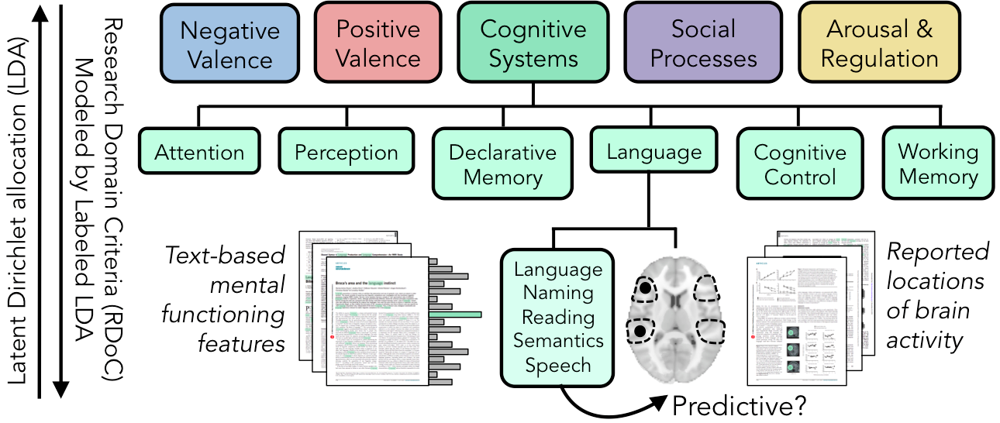

# bayesian-synth

The overall goal of this project is to employ Bayesian inference methods in order to estimate topics for mental functions, which are then evaluated by how well they predict brain activity. We will compare topics derived in an unsupervised manner from the neuroimaging literature against those constrained to the match the content of the Research Domain Criteria (RDoC) framework set forth by the National Institute of Mental Health to guide research in biological psychiatry. Latent Dirichlet allocation (LDA) will be applied as the unsupervised topic modeling approach, and labeled LDA will allow us to match the topics to the constructs of the RDoC framework. Topic modeling will be performed on a corpus of 18,155 human neuroimaging articles that reported spatial locations in the brain found to relate with mental functions. The mental functioning topics will be evaluated not only by perplexity, which is the usual measure of word likelihood under the model, but also by how well they predict reported locations in the brain. This will characterize the biological basis for mental functioning topics and offer the first systematic validation of the RDoC framework.

